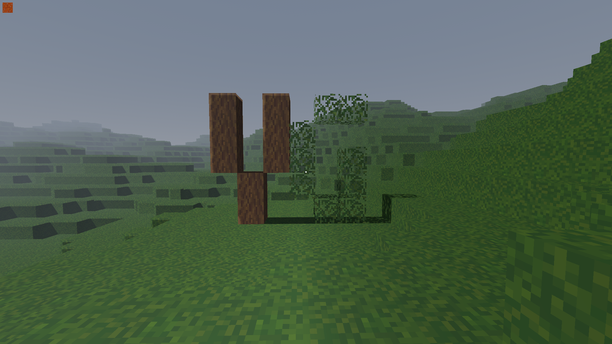

# Minecraft-style procedural world generation in Godot

## Goal

Creating a procedural voxel-based world with biomes and structures, which the player can move around
in and edit, only using Godot's GDScript without native extensions.

## Features

- [x] Basic terrain generation
- [x] Player movement
- [x] Placing and mining blocks
- [ ] Biome generation
- [ ] 3D noise (overhangs)
- [ ] Cave generation
- [ ] Rivers, lakes etc.
- [ ] Trees
- [ ] Structures (villages etc.)
- [ ] Infinite worlds

## Assets

Block assets by [piiixl on itch.io](https://piiixl.itch.io/textures), CC-BY 4.0

